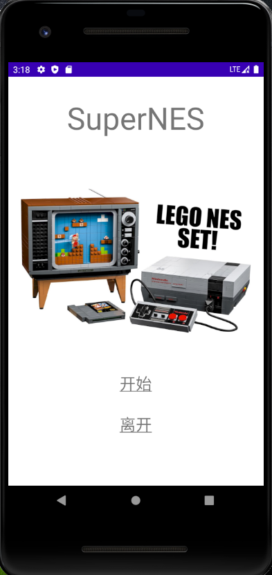
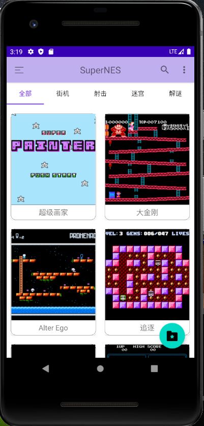
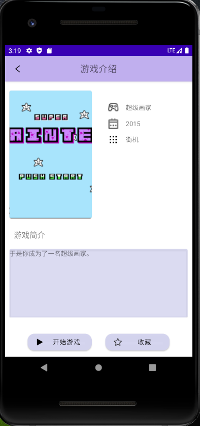
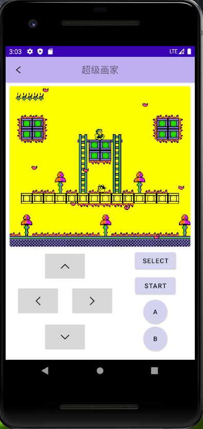

# SuperNES

Super NES Emulator in Android written using Kotlin

+ emulator
+ game framework
+ fontend
+ backend using sqlite

## Snapshots

Some snapshots are as follows:

## Features

+ [x] CPU
+ [x] PPU
+ [x] JoyPads
+ [x] BUS
+ [ ] APU

## Thanks

Our sincere thanks to

+ bugzmanov for his [NES book](https://bugzmanov.github.io/nes_ebook/index.html)
+ Mario Zechner & RoberGreen for their [Beginning Android Games](https://www.apress.com/gp/book/9781430230427)
+ [nesdev](https://nesdev.com/) for nes hardware info and test roms
+ [nesworld](https://www.nesworld.com/) for game roms
+ and [Nintendo](https://www.nintendo.com/) of course

## LICENSE

*MIT license*
